<picture>
  <source media="(prefers-color-scheme: dark)" srcset="assets/header-dark.svg">
  <source media="(prefers-color-scheme: light)" srcset="assets/header-light.svg">
  
</picture>

 

### Shreyas Fegade

First-year CSE @ Manipal University Jaipur
 
I design and build ambitious software using AI-assisted development.

 

<picture>
  <source media="(prefers-color-scheme: dark)" srcset="https://readme-typing-svg.demolab.com?font=Inter&weight=500&size=20&duration=3000&pause=1000&color=E0E0E0&background=FFFFFF00&center=true&vCenter=true&width=550&height=30&lines=Building+market+intelligence+dashboards;Building+file+forensics+in+the+browser;Building+knowledge+graphs+from+textbooks;Tracking+attention+with+information+theory;Killing+decision+paralysis+with+scoring+engines">
  <source media="(prefers-color-scheme: light)" srcset="https://readme-typing-svg.demolab.com?font=Inter&weight=500&size=20&duration=3000&pause=1000&color=000000&background=FFFFFF00&center=true&vCenter=true&width=550&height=30&lines=Building+market+intelligence+dashboards;Building+file+forensics+in+the+browser;Building+knowledge+graphs+from+textbooks;Tracking+attention+with+information+theory;Killing+decision+paralysis+with+scoring+engines">
  
</picture>

---

### What I Build

<table>
<tr>
<td width="50%">

**[REGIME](https://github.com/shreyasfegade/regime)** — Market State Intelligence
 
4-state Hidden Markov Model detecting market regimes in US stocks. Canvas-rendered with particle fields, gradient bleeding, and transition heatmaps.
  

</td>
<td width="50%">

**[Unbored](https://github.com/shreyasfegade/unbored)** — Decision Paralysis Killer
 
One-tap entertainment recommendations with mood-weighted scoring, TMDB/AniList integration, and Gemini-powered contextual reasoning.
  

</td>
</tr>
<tr>
<td width="50%">

**[Forensics](https://github.com/shreyasfegade/forensics)** — Client-Side File Intelligence
 
EXIF parsing, GPS mapping, Shannon entropy analysis, and steganography detection — all in the browser. Zero uploads, zero servers.
  

</td>
<td width="50%">

**[Knowledge Mapper](https://github.com/shreyasfegade/knowledge-mapper)** — Conceptual Knowledge Graphs
 
Upload PDFs to generate interactive force-directed concept graphs with Louvain clustering, cosine similarity filtering, and SSE streaming.
  

</td>
</tr>
<tr>
<td width="50%">

**[Chronicle](https://github.com/shreyasfegade/chronicle)** — Personal Time Intelligence
 
Passive Windows time tracker with Shannon-based Focus Entropy metrics, session stitching, and D3.js timeline visualization. Fully local.
  

</td>
<td width="50%">

**[Shelf](https://github.com/shreyasfegade/shelf)** — File Intelligence Layer
 
Auto-organizes downloads using rule-based classification with confidence scoring. Chrome extension bridge + system tray daemon.
  

</td>
</tr>
<tr>
<td colspan="2" align="center">

**[Portfolio](https://github.com/shreyasfegade/portfolio)** — Developer Portfolio
 
Dark-mode portfolio with spring-physics cursor tracking, scroll-linked letter animations, and Framer Motion transitions.
  

</td>
</tr>
</table>

---

### Tech I Work With

